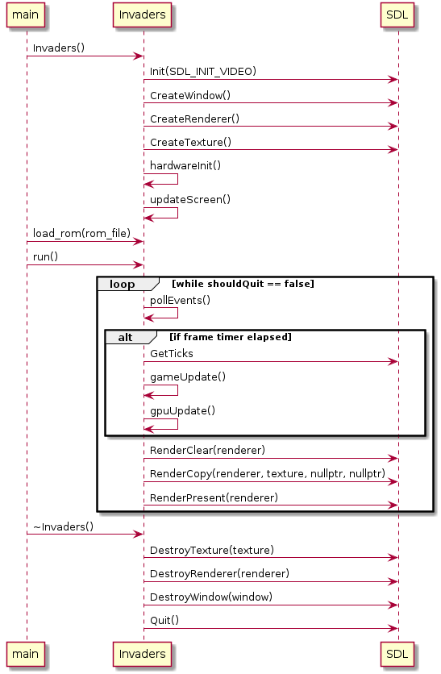

# Space Invaders
Space Invaders is an emulation of the original arcade game running on an Intel 8080 CPU.
This emulation contains the following top level components:

## Video Emulation
The emulation uses the SDL multimedia library to emulate the original screen and video output.

## Input Emulation
The SDL multimedia library is used to emulate player input

# Sequence Diagrams
## Main Sequence

## Game Update

## CPU Update

